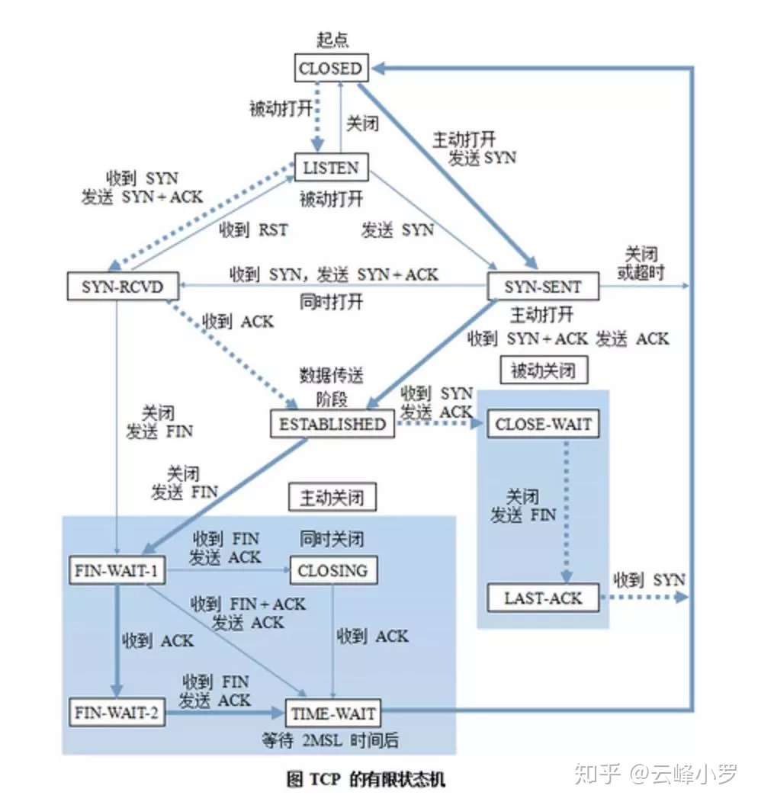

# 有限状态机，Finite-State Machine，FSM


## 1. 概述

有限状态机是一种用来进行对象行为建模的工具，其作用主要是描述对象在它的生命周期内所经历的状态序列，以及如何响应来自外界的各种事件。

在计算机科学中，有限状态机被广泛用于建模应用行为、硬件电路系统设计、软件工程，编译器、网络协议、和计算与语言的研究。比如下图非常有名的TCP协议状态机。



其实我们在编程时实现相关业务逻辑时经常需要处理各种事件和状态切换，写各种switch/case 和if/else ，所以我们其实可能一直都在跟有限状态机打交道，只是可能没有意识到。

在处理一些业务逻辑比较复杂的需求时，可以先看看是否适合用一个有限状态机来描述，如果可以把业务模型抽象成一个有限状态机，那么代码就会逻辑特别清晰，结构特别规整。
下面我们就来聊聊所谓的状态机，以及它如何在代码中实现。


## 2. 状态机的要素

状态机可归纳为4个要素，即**现态**、**条件**、**动作**、**次态**。“现态”和“条件”是因，“动作”和“次态”是果。详解如下：

1. **现态**：是指当前所处的状态。

2. **条件**：又称为“事件”。当一个条件被满足，将会触发一个动作，或者执行一次状态的迁移。

3. **动作**：条件满足后执行的动作。动作执行完毕后，可以迁移到新的状态，也可以仍旧保持原状态。**动作不是必需的**，当条件满足后，也可以不执行任何动作，直接迁移到新状态。

4. **次态**：条件满足后要迁往的新状态。“次态”是相对于“现态”而言的，“次态”一旦被激活，就转变成新的“现态”了。

我们可以用状态表了表示整个过程，如下图所示。


状态表
**这里需要注意的两个问题：**

1. **避免把某个“程序动作”当作是一种“状态”来处理**。那么如何区分“动作”和“状态”？“动作”是不稳定的，即使没有条件的触发，“动作”一旦执行完毕就结束了；而“状态”是相对稳定的，如果没有外部条件的触发，一个状态会一直持续下去。

2. **状态划分时漏掉一些状态**，导致跳转逻辑不完整。
所以维护上述一张状态表就非常必要，而且有意义了。从表中可以直观看出那些状态直接存在跳转路径，那些状态直接不存在。如果不存在，就把对应的单元格置灰。 每次写代码之前先把表格填写好，并且对置灰的部分重点review，看看是否有“漏态”，然后才是写代码。QA拿到这张表格之后，写测试用例也是手到擒来。


## 3.状态机设计

有限状态机设计时应该满足以下设计要求：

- 简单。
- 易于扩展。


### 考虑

状态机核心的概念如下，在**某个状态下**：

1. 状态机接收到一个事件（Event）
2. **动作**【可选】：状态机根据事件，执行一个动作。
3. **迁移**：状态机根据事件，转换到下一个状态。

从上述描述可以看出，**动作**和**迁移**可以合并成一个**状态处理**（等于“**动作**+**迁移**”），也可以分开。两种设计各有优缺点：

1. 合并设计

   优点：简单

   缺点：用户用代码定制所有操作，在一些简单场景下使用比较复杂
   ```python
   states = ['s0', 's1', 's2']
   handlers = [s0_fun, s1_fun, None]  # 每个状态处理包括：动作+转移
   fsm = FSM(states=states, handlers=handlers)
   ```
   
2. 分开设计

   优点：可以单独设置**动作**和**迁移**，使得概念更加直观。

   缺点：复杂度提升；灵活度降低，在某些需要条件转移的情况下，用户无法定制**转移**。
   
   ``` python
   states = ['s0', 's1', 's2']
   actions = [s0_act, s1_act, None]  # 可以不指定actions
   transitions = {
       ('s0', 'evt0'): 's1', 
       ('s1', 'evt0'): 's2', 
       ('s1', 'evt1'): 's0', 
       ('s2', 'evt0'): 's0', 
       ('s2', 'evt1'): 's1', }
   
   fsm = FSM(states=states, actions=actions, transitions=transitions)
   ```


能否兼顾这两种设计，既要简单易用，又能让用户便利使用，还能满足定制和扩展。让我们从用户的视角看一下需要什么样的使用方式和接口。

典型的使用需求包括：

  1. 用户通过指定状态处理函数，完全接管动作和迁移。

   ```python
   states = ['s0', 's1', 's2']

   handlers = [s0_handle, s1_handle, s2_handle]  # 每个状态处理包括：动作+转移
   fsm = FSM(states=states, handlers=handlers)

   handlers = {'s0': s0_handle, 's1': s1_handle}
   fsm = FSM(states=states, handlers=handlers)

   handlers = {'s0': s0_handle, 's1': s1_handle, 's2': s2_handle}
   fsm = FSM(states=states, handlers=handlers)

   ```

   2. 用户指定迁移表，确定迁移状态

   ```python
   states = ['s0', 's1', 's2']
   transitions = {
      's0': [('a', 's1'), ],
      's1': [('a', 's2'), ('b', 's0')],
      's2': [('a', 's0'), ('b', 's1')], }
   fsm = FSM(states=states, transitions=transitions)
   ```

   3. 用户指定迁移表，同时指定某些状态下的状态动作

   ```python
   states = ['s0', 's1', 's2']
   handlers = {'s1': s1_act}
   transitions = {
      's0': [('a', 's1'), ],
      's1': [('a', 's2'), ('b', 's0')],
      's2': [('a', 's0'), ('b', 's1')], }
   fsm = FSM(states=states, handlers=handlers, transitions=transitions)
    
   ```

   4. 用户指定（部分）迁移表，同时指定某些状态下的状态处理（动作+迁移）

   ```python
   states = ['s0', 's1', 's2']
   handlers = {'s1': s1_act, 's2': s2_handle}
   transitions = {
      's0': [('a', 's1'), ],
      's1': [('a', 's2'), ('b', 's0')], }

   fsm = FSM(states=states, handlers=handlers, transitions=transitions)
   ```


### 设计

根据以上需求，可以开展状态机的设计，

1. 如何区分**状态处理**与**动作**：

   简单地说，一个函数（或可调用对象），返回None的是动作，返回 next_state 的是状态处理。

2. 如何处理**转移**：
   
   按照优先级，如下处理：

   * 如果用户定制了**状态处理**，则按照状态处理返回的状态进行转移

   * 否则的话，按照用户提供的转移表（字典），进行状态转移。

