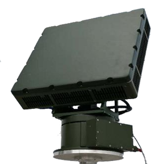
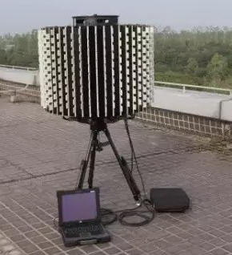
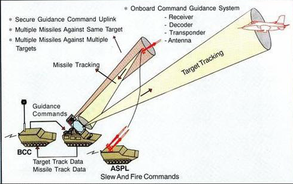
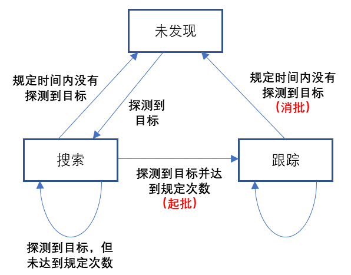

# 探测器

典型的探测设备包括：
- 雷达  
- 光电探测设备  
- 电子侦察设备  

相关设备的具体情况如下：

# 雷达

雷达主要用于探测和跟踪空中目标。

  

## 探测机理

雷达发射电磁波，电磁波经目标反射后，雷达测量反射电磁波的方位和时间间隔，经计算，得到目标的距离和角度（通常包括方位角和仰角）。

 

## 关于目标

根据雷达机理，可以被雷达探测的目标通常具有以下属性：

- RCS（雷达散射截面）：

  目标必须有一定的RCS。对于同一部雷达，目标RCS越大，探测距离越远，反之越近。

- 通视性

  对于绝大部分雷达，目标必须与雷达之间保持通视条件（即雷达和目标之间没有遮挡物），才能被雷达探测到。

- （径向）速度

  大部分低慢小探测雷达为多普勒体制，目标必须相对目标有一定的径向速度，才能被雷达探测到，低于一定径向速度，多普勒雷达就无法探测目标。

## 探测能力

雷达的探测能力指对一定距离的目标的探测的性能。

雷达探测能力与很多因素有关：
- 目标距离

- 目标RCS

- 雷达性能：功率孔径积、雷达波形等

具体的雷达探测能力可以通过雷达方程进行计算。

雷达对目标的探测是概率检测。

通常情况下，可以指定雷达在一定距离下对某个RCS目标的探测能力（如：雷达对 RCS 为 0.1 m^2 的目标探测距离为 3 km）。然后根据雷达方程，大致估算不同距离、不同RCS目标的探测能力。

## 探测范围

雷达能够探测目标的空间角覆盖的范围称为雷达的探测范围。

处于雷达探测范围的目标，才能够被探测。

雷达探测范围通常包括：

- 方位范围：通常是0～360°，即所有方向都可以探测。但是，对于某些相控阵雷达，探测范围是90°～120°左右。

- 俯仰范围：通常是0°～50°。

## 探测状态

雷达在探测目标时，通常具有**搜索**和**跟踪**2种状态。

### 搜索

雷达控制探测波束，在整个探测范围内搜索目标。

由于探测范围通常比较大，而雷达瞬时探测波束相对较窄，所以雷达通常需要一定时间才能搜索完整个探测范围。

常见情况下，雷达搜索一次全空域的时间通常是6～10秒。

### 跟踪

雷达在搜索发现目标后，通常会转入**跟踪**状态。

在跟踪状态，雷达会分配一个波束始终对准和探测目标。此时，雷达能够快速连续获取目标位置、距离。

常见情况下，雷达跟踪目标时，每1秒能够更新一次目标信息。

### 起批与消批

以一个目标为例，雷达通常处于“未发现—搜索—跟踪”3个状态之间转换。

典型状态转换过程如下：
1. 目标处于“未发现”状态

2. 雷达搜索目标，发现目标后，目标处于“搜索”状态；目标连续若干次（通常是3次）处于“搜索”状态后，转入“跟踪”状态（简称**起批**）；否则转入“未发现”状态

3. 目标在“跟踪”状态下，如果持续探测到目标，则维持“跟踪”状态；如果持续一定时间未探测到目标，则转入“未发现”状态（简称**消批**）

雷达状态转换图如下：

**需要注意的是，雷达通常只在跟踪状态下上报探测结果！！！**

### 目标批数

目标批数指雷达同时搜索/跟踪的目标数量。

现代雷达通常采用电扫/机电混合体制，能够处理的目标批数较多，通常为数十个至数百个不等。

# 光电探测设备

# 电子侦察设备